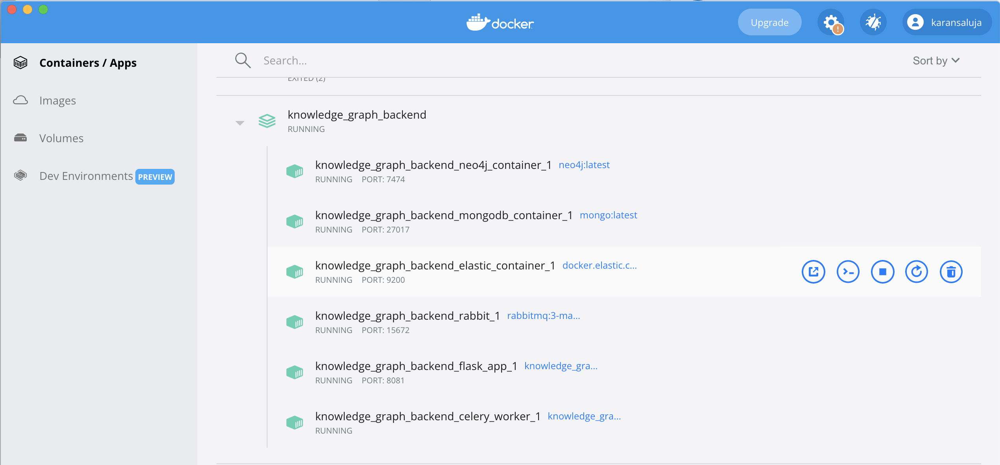
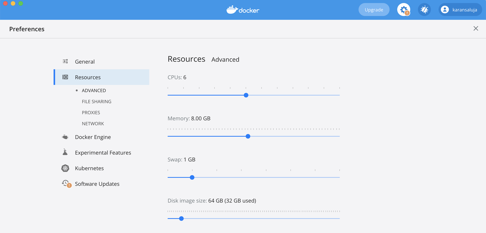

# knowledge_graph_backend

## Design


## Frontend
Frontend is available as a separate repository https://github.com/Karansaluja/knowledge_graph_frontend/tree/master.

## Flask App
### Api Details

-------------
**POST -  /extract_relations**<br>
About - A document can be added either in the text area or
its s3 url can be specified. Relation triplets will be extracted from the document
in a async manner. The api immediately responds with a task_id that can be tracked.

**Request**
```json
{
    "data": "Amitabh Bachchan born on 11 October 1942 is an Indian actor, film producer, television host, occasional playback singer and former politician known for his work in Hindi cinema. He is regarded as one of the most influential actors in the history of Indian cinema. During the 1970s–1980s, he was the most dominant actor in the Indian movie scene; the French director François Truffaut called him a \"one-man industry\". Bachchan was born in 1942 in Allahabad to the Hindi poet Harivansh Rai Bachchan and his wife, the social activist Teji Bachchan. He was educated at Sherwood College, Nainital, and Kirori Mal College, University of Delhi. His film career started in 1969 as a voice narrator in Mrinal Sen's film Bhuvan Shome. He first gained popularity in the early 1970s for films such as Zanjeer, Deewaar and Sholay, and was dubbed India's \"angry young man\" for his on-screen roles in Hindi films. Referred to as the Shahenshah of Bollywood (in reference to his 1988 film Shahenshah), Sadi ka Mahanayak (Hindi for, \"Greatest actor of the century\"), Star of the Millennium, or Big B, he has since appeared in over 200 Indian films in a career spanning more than five decades, and has won numerous accolades in his career, including four National Film Awards as Best Actor, Dadasaheb Phalke Award as lifetime achievement award and many awards at international film festivals and award ceremonies. He has won sixteen Filmfare Awards and is the most nominated performer in any major acting category at Filmfare, with 42 nominations overall. In addition to acting, Bachchan has worked as a playback singer, film producer and television presenter. He has hosted several seasons of the game show Kaun Banega Crorepati, India's version of the game show franchise, Who Wants to Be a Millionaire?. He also entered politics for a time in the 1980s.",
    "inputType": "textBox",
    "graphName": ""
}
```
**Response**<br>
Raw task_id is received as response.
```
e8435c9d-4262-4895-bed4-9a46a54006f1
```
---------------
**GET - /get_ingestion_status** <br>
About - This api is used to track the status of a task. If the task is complete, it'll
respond with the status `DONE` else `INPROGRESS`.

**Request**
```
curl --location --request GET
'localhost:8081/get_ingestion_status?task_id=e8435c9d-4262-4895-bed4-9a46a54006f1'
```
**Response**
```
INPROGRESS
```
------------------
**GET - /get_sample_relations** <br>
About - This api can be used to fetch a sample of relations extracted from a given 
ingestion request.

**Request**
```
curl --location --request GET
 'localhost:8081/get_sample_relations?task_id=e8435c9d-4262-4895-bed4-9a46a54006f1'
```

**Response**
```
[
    {
        "head": "Amitabh Bachchan",
        "type": "mother",
        "tail": "Teji Bachchan 
    },
    {
        "head": "Amitabh Bachchan",
        "type": "date of birth",
        "tail": "1942"
    }
]
```
-----------
**POST - /add_template** <br>
About - This api can be used to add a new template for a relation.

**Request**
```json
{
  "template": "who is the father of (.*)( |)\\?",
  "relation": "father",
  "entity_group": "0"
}
```

**Response** <br>
```json
{"message": "template ingested successfully"}
```
------------
**POST - /search_template** <br>
About - Using this api, client can query knowledge graph by asking questions.

**Request**
```json
{
  "question": "who is the father of Amitabh Bachchan ?"
}
```
**Response**
```
Harivansh Rai Bachchan
```
--------------
**GET - /get_relation_list** <br>
About - This api provides a list of all the available relations

**Request**
```
curl --location --request GET 'localhost:8081/get_relation_list'
```
**Response**
```
[
  "mother",
  "father",
  "spouse",
  "child",
  ....
  ....
  ....
]
```
--------------
**GET - /get_template** <br>
About - This api allows client to fetch templates associated with a given relation.

**Request**
```
curl --location --request GET 'localhost:8081/get_template?relation=mother'
```

**Response**
```
[
    "who is the mother of (.*)( |)\\?"
]
```
--------------
## Running the server
- In the root path of the repository run the following command
`docker-compose up --build`
- Check if all containers are in running state. You can start a container by clicking 
on start button through docker ui.

- If the containers are not starting, it is most likely because of OOM issue. Make sure
you provide atleast 8Gb of RAM to docker.


